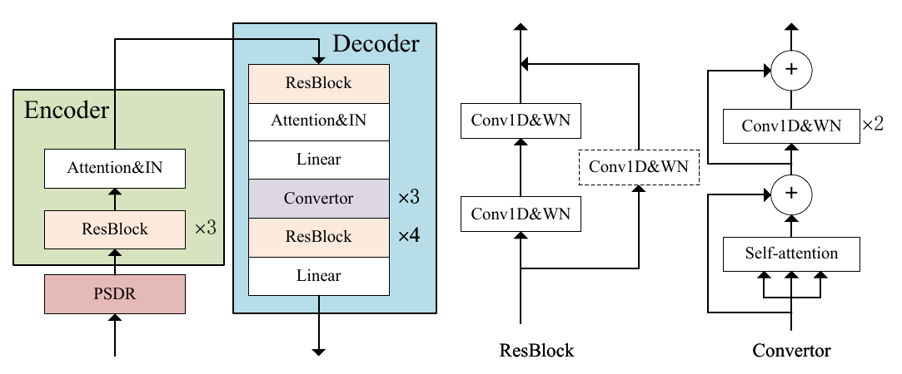

# SingleVC

SingleVC performs any-to-one VC, which is an important component of [MediumVC project](https://github.com/BrightGu/MediumVC). 
Here is the official implementation of the paper,[2107.09477.pdf](https://github.com/navidjm77/SingleVC/files/10322024/2107.09477.pdf)


## About this project

In voice conversion (VC), an approach showing promising results in the latest voice conversion challenge (VCC) 2020 is to first use an automatic speech recognition (ASR) model to transcribe the source speech into the underlying linguistic contents; these are then used as input by a text-to-speech (TTS) system to generate the converted speech. Such a paradigm, referred to as ASR+TTS, overlooks the modeling of prosody, which plays an important role in speech naturalness and conversion similarity. Although some researchers have considered transferring prosodic clues from the source speech, there arises a speaker mismatch during training and conversion. To address this issue, in this work, we propose to directly predict prosody from the linguistic representation in a target-speaker-dependent manner, referred to as target text prediction (TTP). We evaluate both methods on the VCC2020 benchmark and consider different linguistic representations. The results demonstrate the effectiveness of TTP in both objective and subjective evaluations.

## Summery Of Repo

To realize any-to-any (A2A) voice conversion (VC), most methods are to perform symmetric self-supervised reconstruction tasks (Xi ! ^ Xi), which usually results in inefficient performances due to inadequate feature decoupling, especially for unseen speakers.


Here is the other useful official implementation of the paper, [MediumVC](http://arxiv.org/abs/2110.02500).

The following are the overall model architecture.


## Project Traslation
[ترجمه مقاله.pdf](https://github.com/mahdeslami11/SingleVC/files/10410997/default.pdf)

## project Explanation

Video:
https://drive.google.com/file/d/1iANt6SI58wTDjPs7tvNai0G9HVL3jOrY/view?usp=drivesdk


For the audio samples, please refer to our [demo page](https://brightgu.github.io/SingleVC/). The more details can be found in "any2one/demo_page/ConvertedSpeeches/".

### Envs
You can install the dependencies with
```bash
pip install -r requirements.txt
```

### PSDR
[PSDR](http://www.guitarpitchshifter.com/algorithm.html) means scaling F0 and correlative harmonics with duration remained, which intuitively modifying the speaker-related information while maintaining linguistic content and prosodic information. PSDR can be used as a data augment strategy for VC by producing fake parallel corpus. To verify its feasibility that slight pitch shifts don't affect content information,  we measure the word error rate(WER) between source speeches and pitch-shifted speeches through [Wav2Vec2-based ASR System](https://github.com/huggingface/transformers). The speeches of p249(female) from VCTK Corupsis selected, and [pyrubberband](https://github.com/bmcfee/pyrubberband) is utilized to  execute PSDR. Table indicates that when S in -6~4, the strategy applies to VC with acceptable WERs.

| S | -7 | -6 | -5 |0 | 3| 4 | 5 |
| :------:| :------: | :------: |:------: |:------: |:------: |:------: |:------: |
| WER(%) | 40.51 | 25.79 |17.25 |0 |17.27 |25.21 |48.14 |


### Vocoder
The [HiFi-GAN](https://github.com/jik876/hifi-gan) vocoder is employed to convert log mel-spectrograms to waveforms. The model is trained on universal datasets with 13.93M parameters. Through our evaluation, it can synthesize 22.05 kHz high-fidelity speeches over 4.0 MOS, even in cross-language or noisy environments.

## pretrained models
You can download the pretrained model as well as the vocoder following the [link](https://drive.google.com/file/d/1yV9cCne7piqBI9vng13JDdLuRlMkTbZR/view?usp=sharing), and then edit the config file any2one/infer/infer_config.yaml.  Infer corpus should be organized as test22050/*.wav
You can convert an list of  utterances, e.g.
```bash
python any2one/infer/infer.py
```
## Train from scratch

### select acceptable pitch shifts
If you want to reconstruct someone's voice, you need to calculate the acceptable pitch shifts of that person first. Edit the "any2one/tools/wav2vec_asr.py" and config the "wave_dir" as "speech16000_dir". The ASR model provided in "any2one/tools/wav2vec_asr.py" only supports English speech recognition currently. You can replace it for other languages. In our test, the acceptable pitch shifts of  p249 in VCTK-Corups are [-6,4].
```bash
python any2one/tools.wav2vec_asr.py
```
**tips:** In practice, it performers a higher probability of success to build  female voices than male voices . Compared to males, the periodic patterns of females perform more stable due to the higher frequency resolution. 

The train corpus should be organized as vctk22050/p249/*.wav
```bash
python any2one/solver.py
```
### Preprocessing
1. The model is trained with random pitch shifted speeches processed in real-time. If you want to speed up the training, please refer the code in "any2one/meldataset.py" to have data preprocessed.
2. If use preprocess method in HiFi-GAN vocoder, the training will take about one day with TITAN Xp, and the performances will be more robust. However, using preprocess method in WaveRNN,  the training will just spend three hours.

These papers help to better undrestand SingleVC:

[2107.09477.pdf](https://github.com/navidjm77/SingleVC/files/10322055/2107.09477.pdf)

[1102.1364.pdf](https://github.com/navidjm77/SingleVC/files/10322056/1102.1364.pdf)

[1943-7714-article-p481.pdf](https://github.com/navidjm77/SingleVC/files/10322059/1943-7714-article-p481.pdf)

[cignatov,+16_Fraim_ReviewMedLight.pdf](https://github.com/navidjm77/SingleVC/files/10322061/cignatov.%2B16_Fraim_ReviewMedLight.pdf)

[Discourse_Language_New_Media20190920_105897_lfle69_with_cover_page.pdf](https://github.com/navidjm77/SingleVC/files/10322063/Discourse_Language_New_Media20190920_105897_lfle69_with_cover_page.pdf)

[document.pdf](https://github.com/navidjm77/SingleVC/files/10322067/document.pdf)

[hsee-medium-jcr2003.pdf](https://github.com/navidjm77/SingleVC/files/10322068/hsee-medium-jcr2003.pdf)

[jbacter00339-0098.pdf](https://github.com/navidjm77/SingleVC/files/10322069/jbacter00339-0098.pdf)

[MANetal1960MRSmedium.pdf](https://github.com/navidjm77/SingleVC/files/10322072/MANetal1960MRSmedium.pdf)

[masters2007.pdf](https://github.com/navidjm77/SingleVC/files/10322074/masters2007.pdf)

[MEDIUM_THEORY_0386-with-cover-page-v2.pdf](https://github.com/navidjm77/SingleVC/files/10322075/MEDIUM_THEORY_0386-with-cover-page-v2.pdf)

[Small_and_Medium_Enterprises_Across_the_20170213_16161_1yt45no_with.pdf](https://github.com/navidjm77/SingleVC/files/10322092/Small_and_Medium_Enterprises_Across_the_20170213_16161_1yt45no_with.pdf)

## Also, in the future we can work on these parts to make the SingleVC work better

Identification of the speaker

Detection of emotional states (laughter, crying, anger, etc.)

Convert speech into other language phrases

## Navid Jamshidzadeh (40114140111012)

I am a master's student at South Tehran University, in the field of medical engineering, bioelectrical orientation. This project is related to the course of digital signal processing.

## You can see the presentation of this project on the following site :

https://drive.google.com/file/d/1hWrcyBYS1WxgJwCxPt1LQrNSy3cElwF/view?usp=drivesdk

## Orginal Project:
https://github.com/BrightGu/SingleVC
